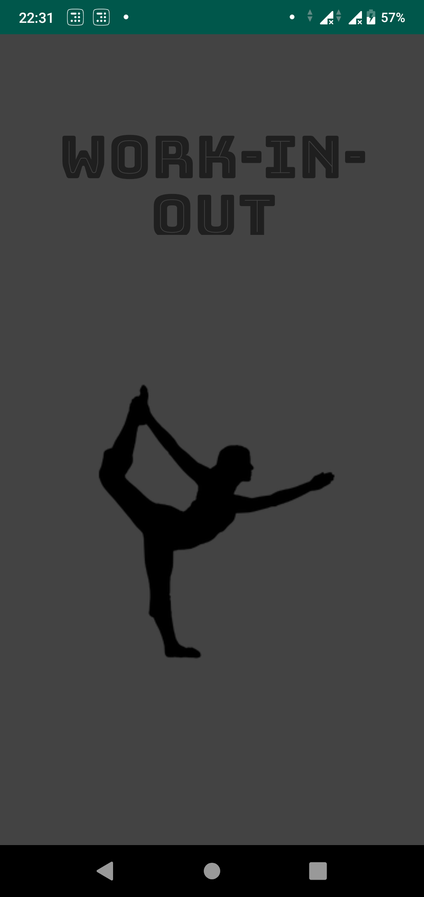
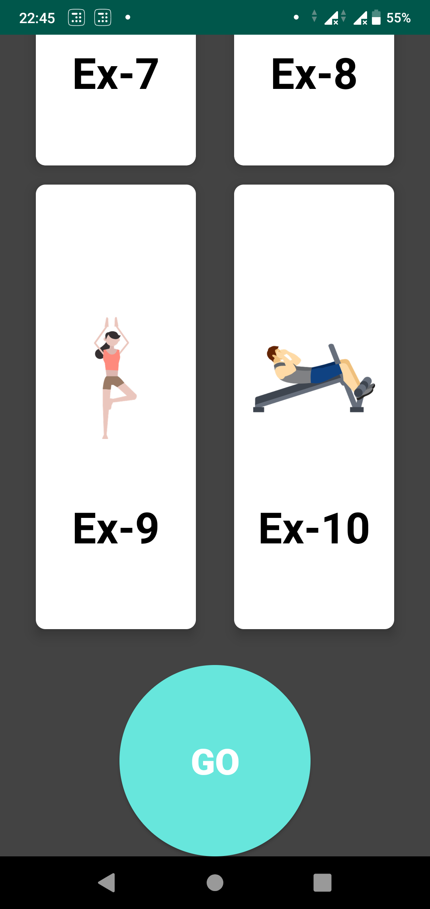
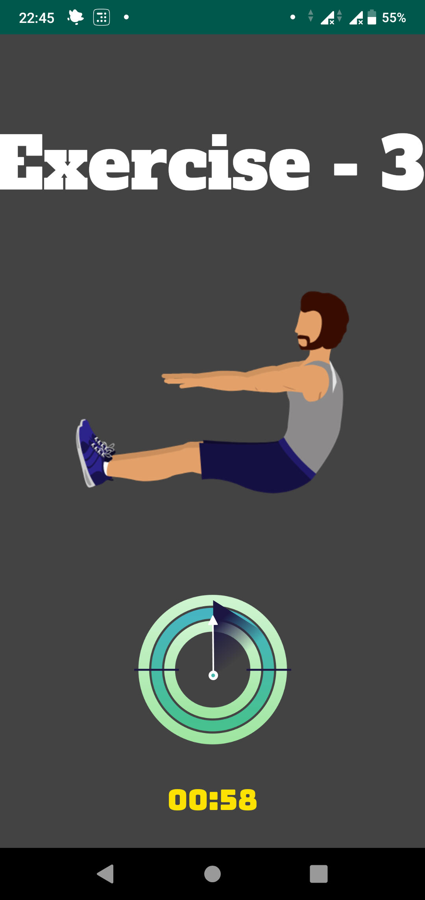

# Work-in-Out App

This is official submission for the Hackathon. 

App name- Work-in-Out 

Domain - The app is built to  Helping people who are working remotely from home and supporting at risk and quarantined people during the COVID-19 pandemic.

Descritption - 

So this app is like workout app which suggests you to do 5 exercises daily which you can do at your house with least requirement of external gear stuff. Now you maybe thinking that this app is nothing but a normal health fitness app but here comes the twisiting part this app suggests you easy to do random exercises everyday with a fixed amount of time and sets. This app aims at helping two groups of people - one who are working remotely from home, and the other Supporting at risk and quarantined people, by making them fit and energize during this time of crisis. 

As soon as you open the app, It selects 5 exercise for you in the background. 

Every exercise will have different duration.
For ex: pushpus - 5 mins
crunches: 4 mins
plank: 40 seconds

Break duration is fixed: 10 seconds

App will play music for the duration of exercise. To indicate that there is a break, music will stop and will resume as soon as break is over.

# Screenshots of the App 
	 							 							

